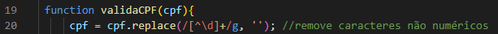
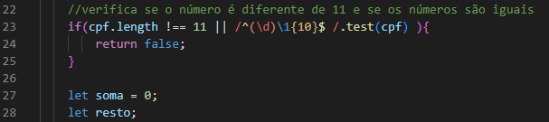
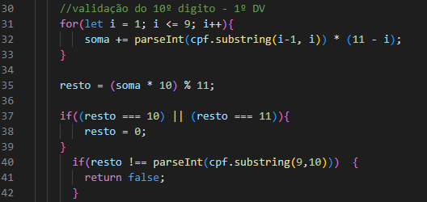
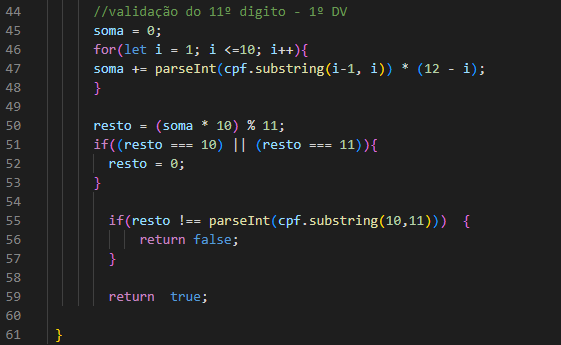
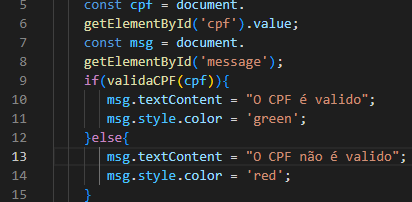

# `Validações de E-mail e CPF.`
 
* [Introdução](#introdução)
* [Funcionalidade](#funcionalidade)
* [Tecnologias Utilizadas](#tecnologias-utilizadas)
* [Resultado](#resultado)
* [Autores](#autores)

## `INTRODUÇÃO`
     Este projeto foi desenvolvido para demonstrar como validar e-mails e CPFs de forma eficaz utilizando JavaScript e técnicas de validação básica. A validação de e-mail e CPF é uma etapa crucial em muitos sistemas, garantindo que os dados inseridos pelos usuários estejam no formato correto antes de serem processados ou armazenados.

## `FUNCIONALIDADE:`
## ``E-mail``
    A validação de email geralmente envolve verificar se o formato do email está correto (por exemplo, se contém um "@" e um "." depois do "@"), mas não verifica se o email realmente existe ou é válido em um servidor. 

     Expressão regular :
    "  " Verifica se o campo está preenchido
    " @ " Verifica literalmente a presença de @.
    " . " Verifica literalmente a presença de .

    Função checarEmail: 
    Esta função usa a expressão regular re para testar se o email passado como argumento corresponde ao padrão especificado. Se corresponder, retorna TRUE; caso contrário, retorna FALSE.

# ``CPF``
    Para validar um CPF, não é apenas verificar se os dígitos estão no formato correto, mas também aplicar regras matemáticas específicas para garantir que o número seja válido.
# ``Função validaCPF``
    Esta função validaCPF é responsável por verificar se um CPF fornecido é válido.
• Primeiro, ela remove todos os caracteres não numéricos do CPF usando ``.replace(/[^\d]+/g, '')``

Em seguida, verifica se o CPF tem exatamente 11 dígitos e se não são todos iguais (por meio da expressão regular ``/^(\d)\1{10}$/)``.

    Calcula os dígitos verificadores do CPF usando as regras matemáticas específicas para CPF:

• Calcula o primeiro dígito verificador e compara com o décimo dígito do CPF.

• Calcula o segundo dígito verificador e compara com o décimo primeiro dígito do CPF.

    Se todos os passos de validação forem bem-sucedidos, a função retorna TRUE, indicando que o CPF é válido; caso contrário, retorna FALSE.
# ``Atualização da Mensagem na Página:``
    Dentro do event listener do formulário, após chamar a função validaCPF, o código atualiza uma mensagem na página conforme o resultado da validação:

``document.getElementById('cpf').value`` recupera o valor do campo de entrada de CPF no formulário.

``msg.textContent`` é atualizado com uma mensagem indicando se o CPF é válido ou não.

A cor do texto da mensagem ``(msg.style.color)`` é definida como verde para CPF VÁLIDO e vermelho para CPF INVÁLIDO.

## `TECNOLOGIAS UTILIZADAS:`
    JavaScript: Para implementação das funções de validação.
    HTML5/CSS: Para estrutura e apresentação dos formulários de entrada.

## `RESULTADO:`
    E-mail:

    CPF:

## `AUTORES:`
    Camila Casagrande Garcia.